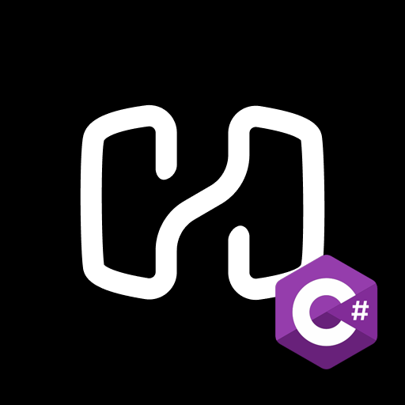

<p align="center">
  
  <br>
  <strong>HevySharp</strong>
</p>

A lightweight .NET 10 wrapper for the [Hevy API]([https://api.hevyapp.com](https://api.hevyapp.com/docs/#/)), giving you typed access to workouts, routines, exercise templates, and more from your C# applications.

> **Requires** a [Hevy Pro](https://www.hevy.com) subscription. Generate your API key at [hevy.com/settings?developer](https://hevy.com/settings?developer).

## Features

- **Full API coverage** — Workouts, Routines, Routine Folders, Exercise Templates, Exercise History, and User Info.
- **Automatic `@` sanitization** — The Hevy API silently fails when text fields contain `@`. HevySharp replaces it for you before every request.
- **Read-only field stripping** — `PUT` requests automatically omit `id`, `created_at`, `updated_at`, etc. so the API never rejects your updates.
- **JSON body wrapping** — `POST`/`PUT` payloads are wrapped in their resource key (`{"workout": {...}}`) as the API requires.
- **Dependency-injection friendly** — Accepts an `HttpClient` via constructor for easy testing and DI.
- **Zero external dependencies** — Built on `System.Text.Json` and `HttpClient` only.

## Quickstart

### 1 — Reference the project

Add a project reference to `HevySharp` (or the resulting NuGet package once published):

```xml
<ProjectReference Include="..\HevySharp\HevySharp.csproj" />
```

### 2 — Authenticate

```csharp
using HevySharp;

var api = new HevyAPI();
bool success = await api.AuthoriseHevy("YOUR_API_KEY");
```

`AuthoriseHevy` validates the key against the Hevy API and sets `api.IsAuthorised`. All other methods throw `InvalidOperationException` if called before a successful authorisation.

### 3 — Fetch your workouts

```csharp
using HevySharp.Schemas;

var response = await api.GetWorkouts(page: 1, pageSize: 10);

foreach (var workout in response!.Workouts!)
{
    Console.WriteLine($"{workout.Title}  {workout.StartTime}");
    foreach (var exercise in workout.Exercises!)
    {
        Console.WriteLine($"  - {exercise.ExerciseTemplateId}");
        foreach (var set in exercise.Sets!)
            Console.WriteLine($"       {set.Type}: {set.WeightKg} kg x {set.Reps}");
    }
}
```

### 4 — Create a workout

```csharp
var workout = new HevyWorkout
{
    Title     = "Morning Push",
    StartTime = "2026-03-05T08:00:00Z",
    EndTime   = "2026-03-05T09:00:00Z",
    Exercises =
    [
        new HevyExercise
        {
            ExerciseTemplateId = "ex_bench_press",
            Notes = "Felt great",
            Sets =
            [
                new HevySet { Type = "warmup",  WeightKg = 60,  Reps = 10 },
                new HevySet { Type = "normal",  WeightKg = 100, Reps = 8  },
                new HevySet { Type = "failure", WeightKg = 100, Reps = 5  }
            ]
        }
    ]
};

var created = await api.CreateWorkout(workout);
Console.WriteLine($"Created workout {created!.Id}");
```

### 5 — More examples

```csharp
// Routines
var routines = await api.GetRoutines();
var newRoutine = await api.CreateRoutine(new HevyRoutine
{
    Title = "Leg Day",
    Exercises = [ new HevyExercise { ExerciseTemplateId = "ex_squat" } ]
});

// Routine folders
var folders = await api.GetRoutineFolders();
await api.CreateRoutineFolder(new HevyRoutineFolder { Title = "Powerlifting" });

// Exercise templates
var templates = await api.GetExerciseTemplates(page: 1, pageSize: 10);
await api.CreateExerciseTemplate(new HevyExerciseTemplate
{
    Title = "Zercher Squat",
    MuscleGroup = "legs",
    EquipmentCategory = "barbell"
});

// Exercise history
var history = await api.GetExerciseHistory("ex_bench_press");

// User info
var user = await api.GetUserInfo();
Console.WriteLine($"Hello, {user!.Username}!");

// Workout count and events
int count = await api.GetWorkoutCount();
var events = await api.GetWorkoutEvents();
```

## Important API Quirks (handled automatically)

| Quirk | What HevySharp does |
|---|---|
| POST/PUT bodies must be wrapped in the resource key | Wraps automatically (`{"workout": {...}}`, `{"routine": {...}}`, etc.) |
| `@` in text fields causes silent failures | Replaced with `at` in all text fields before sending |
| PUT must omit read-only fields (`id`, timestamps) | Nulls them out; `WhenWritingNull` omits them from JSON |

## Project Structure

```
HevySharp/
  HevyAPI.cs                          # Main client - all API methods
  Schemas/
    HevySet.cs                        # Individual set (type, weight, reps)
    HevyExercise.cs                   # Exercise within a workout or routine
    HevyWorkout.cs                    # Workout model
    HevyRoutine.cs                    # Routine model
    HevyRoutineFolder.cs              # Routine folder model
    HevyExerciseTemplate.cs           # Exercise template model
    HevyExerciseHistory.cs            # Exercise history + entry models
    HevyUserInfo.cs                   # User info model
    PaginatedResponses.cs             # Paginated response wrappers
```

## Requirements

- **.NET 10** (or later)
- A **Hevy Pro** subscription with a developer API key

## Full Documentation

See **[DOCUMENTATION.md](DOCUMENTATION.md)** for a complete API reference covering every method, model, property, enum value, and pagination detail.

## License

This project is provided as-is. See the repository for license details.
